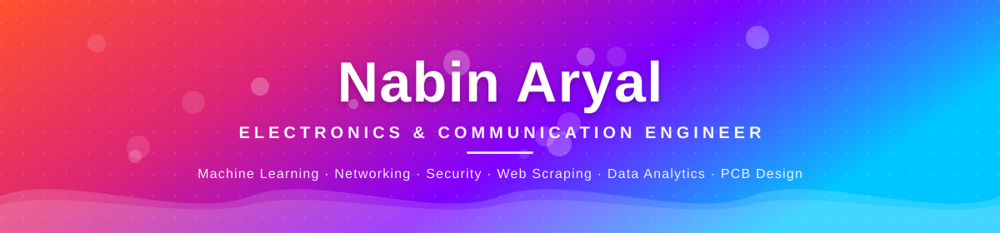
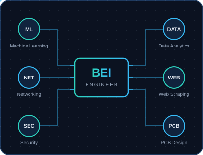

 <!-- ───────────── HERO BANNER ───────────── --> <!-- Techy typing line (Orbitron font) -->  <!-- Friendly script-style typing line (Pacifico font) -->  
 𝓑𝓾𝓲𝓵𝓭𝓲𝓷𝓰 · 𝓛𝓮𝓪𝓻𝓷𝓲𝓷𝓰 · 𝓖𝓻𝓸𝔀𝓲𝓷𝓰 
 <!-- Colorful info badges -->    
 <!-- Rainbow divider -->  <!-- ───────────── ABOUT ───────────── --> 
  
 <table> <tr> <td width="60%" valign="top">

Hi, I'm Nabin Aryal 👋

I hold a Bachelor's in Electronics, Information and Communication Engineering (BEI) from Western Regional Campus (WRC), Pokhara, graduating with first division.

I like learning by building. Most of my work is self-taught project work across:

🤖 Machine Learning: prediction and recommendation notebooks
🌐 Networking: OSI / TCP-IP, router and switch configuration
🛡️ Security: SOC analytics with Wazuh
🕷️ Web Scraping: automation with Playwright
📊 Data Analytics: Pandas and Power BI dashboards
🔌 PCB Design: from schematic to board layout

📍 Based in Butwal, Rupandehi, Nepal 🎯 Looking for entry-level engineering roles and higher-study opportunities

</td> <td width="40%" align="center" valign="middle"> <!-- Animated circuit graphic (file: circuit.svg) -->  </td> </tr> </table> <!-- ───────────── SKILLS & TECH ───────────── -->

 <!-- ───────────── PROJECTS ───────────── --> 
  
 <table> <tr> <td width="33%" valign="top" align="center">
🤖 Machine Learning

Book-recommendation and car-price-prediction notebooks, plus practice classification sets.

View repo

</td> <td width="33%" valign="top" align="center">
📊 Power BI Dashboards

Practice dashboards for data analytics and visual storytelling.

View repo

</td> <td width="33%" valign="top" align="center">
🕷️ Web Scraping

Automated data collection with Python and Playwright.

View repo

</td> </tr> </table>
🛡️ Also explored (self-taught)
SOC analytics with Wazuh: monitoring, alerts, and log analysis
Networking labs: router and switch configuration, TCP/IP troubleshooting
PCB design: schematic capture and board layout practice
Basic web design with HTML/CSS
<!-- ───────────── CURRENTLY ───────────── --> 
  

🔭 Building more ML and data analytics projects
🌱 Deepening my knowledge of network security and SOC tooling
🔧 Practicing PCB design and embedded electronics
🤝 Open to collaboration, internships, and entry-level engineering roles

⚽ Beyond the Screen
      
 <!-- ───────────── CONNECT ───────────── --> 
 

 

  

  

